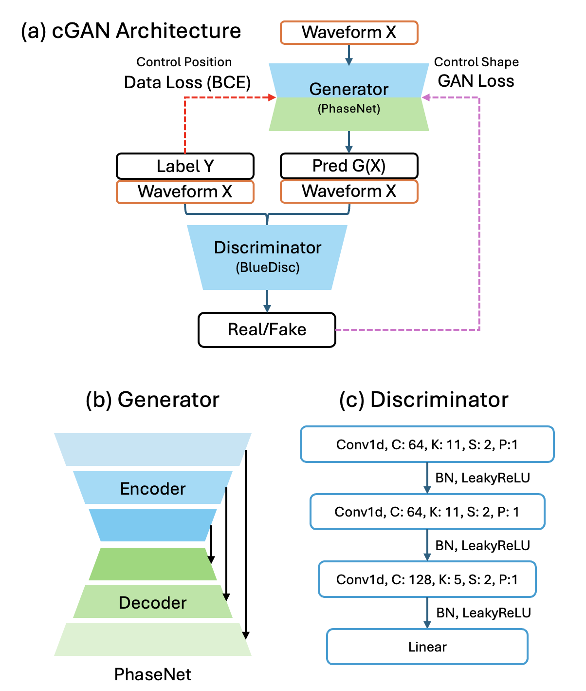

# BlueDisc: Adversarial Shape Learning for Seismic Phase Picking

> **Note**: BlueDisc (SeisBlue Discriminator) is a core component of the [SeisBlue](https://github.com/SeisBlue/SeisBlue)

This repo is a minimal, reproducible implementation to validate the paper "Diagnosing and Breaking Amplitude Suppression in Seismic Phase Picking Through Adversarial Shape Learning." It augments a PhaseNet generator with a lightweight conditional discriminator (BlueDisc) to enforce label shape learning, which eliminates the 0.5-amplitude suppression band and increases effective S-phase detections.

- Core idea: combine BCE Loss with a cGAN shape critic to decouple shape learning from temporal alignment



## Quick start

Prereqs
- Python 3.10+
- PyTorch (install per your platform: https://pytorch.org/get-started/locally/)
- MLflow 2.x (already in requirements)
- GPU: NVIDIA GPU recommended for training

> **Reproducibility Note**: GPU architecture affects GAN convergence. Newer GPUs (e.g., RTX 3090) support lower-precision computation and show better convergence than older models (e.g., GTX 1080 Ti) in our tests. Results in the paper were obtained using RTX 3090. When using different GPU architectures, you may need to adjust the `--data-weight` (λ) parameter to achieve similar results.

Setup
```bash
python -m venv .venv
source .venv/bin/activate
pip install -r requirements.txt
# Install PyTorch separately per platform (CPU/CUDA/MPS), e.g.:
# pip install torch torchvision torchaudio --index-url https://download.pytorch.org/whl/cpu
```

Start MLflow (required)
```bash
mlflow ui
# or
python -m mlflow ui
```

Train
- BCE only (no GAN):
```bash
python 01_training.py \
  --label N \
  --dataset InstanceCounts \
  --max-steps 10000
```
- Conditional GAN: set a data loss weight (λ), e.g. 4000 per paper
```bash
python 01_training.py \
  --label N \
  --dataset InstanceCounts \
  --data-weight 4000 \
  --max-steps 10000
```
Notes
- `--dataset` is a [SeisBench dataset class name](https://seisbench.readthedocs.io/en/stable/pages/documentation/data.html#seisbench.data.instance.InstanceCounts) (e.g., `InstanceCounts`, `ETHZ`). The dataset will be downloaded by SeisBench on first use.
- `--label` controls the output channel order: `N` (noise) or  `D` (detection).

Infer
1) Find the `run_id` from MLflow UI or `mlruns/*/*/meta.yaml`.
2) Run inference (choose split and optional checkpoint by step/epoch):
```bash
python 02_inference.py \
  --run-id <RUN_ID> \
  --dataset InstanceCounts 
```

Evaluate
```bash
python 03_evaluation.py \
  --run-id <RUN_ID> 
```
Outputs are saved under `mlruns/<experiment>/<run_id>/artifacts/` (waveforms, labels, predictions as HDF5; checkpoints under `checkpoint/`; matching CSVs under `<split>/matching_results/`).

## Visualization

The repository includes several plotting scripts to analyze model behavior during and after training:

### Training-based visualization (using logged tracking data)
During training, the model automatically logs sample predictions at each step. You can visualize training progression using:
- `plot_compare_runs.py`: side-by-side comparison of predictions from different runs at the same step


- `plot_compare_shape.py`: compare prediction shapes at selected training steps


- `plot_compare_time.py`: visualize how predictions evolve over training steps for a specific sample


These scripts work directly with the tracking data logged during training (`mlruns/<experiment>/<run_id>/artifacts/track/`).

### Inference-based visualization (requires test dataset predictions)
- `plot_compare_peak.py`: analyze peak detection accuracy by comparing predicted peaks with ground-truth labels. **Requires running both inference (`02_inference.py`) and evaluation (`03_evaluation.py`)** on the test dataset first. The evaluation step generates matching results (`matching_results/` CSVs) that pair each predicted peak with its corresponding label peak, enabling quantitative analysis of detection performance.


### Data exploration
- `plot_compare_phase.py`: visualize P and S phase label arrangements in the dataset. This is a data exploration tool independent of model training.


## Repo layout
- `01_training.py`, `02_inference.py`, `03_evaluation.py`: train → infer → evaluate pipeline
- `module/`: generator (PhaseNet wrapper), discriminator (BlueDisc), GAN training loop, data pipeline, logger
- `plot_*.py`: visualization scripts for analyzing training, inference, and data
- `mlruns/`: MLflow experiments and artifacts
- `docs/`: short documentation
- `loss_landscape/`: standalone loss-landscape simulations (BCE toy experiments)
  - `loss_landscape_analysis.py`: BCE loss surface visualization (height vs. time/peak)
  - `no_model_bce_test.py`: point-wise vs Gaussian-parameterized BCE optimization


## Citation

Please cite the paper when using this code:

> **Note**: This paper is currently under submission. The citation information will be updated once the manuscript receives its arXiv or journal identifier.

```bibtex
@article{huang2025bluedisc,
  title={Diagnosing and Breaking Amplitude Suppression in Seismic Phase Picking Through Adversarial Shape Learning},
  author={Chun-Ming Huang and Li-Heng Chang and I-Hsin Chang and An-Sheng Lee and Hao Kuo-Chen},
  journal={Manuscript under submission},
  year={2025},
  note={Manuscript under submission}
}
```

## References

Key papers referenced in this work:

- **PhaseNet**: Zhu, W., & Beroza, G. C. (2019). PhaseNet: a deep-neural-network-based seismic arrival-time picking method. *Geophysical Journal International*, 216(1), 261-273.  
  DOI: [10.1093/gji/ggy423](https://doi.org/10.1093/gji/ggy423)

- **GAN**: Goodfellow, I., Pouget-Abadie, J., Mirza, M., et al. (2014). Generative adversarial nets. *NeurIPS*.  
  [Paper](https://papers.nips.cc/paper_files/paper/2014/hash/f033ed80deb0234979a61f95710dbe25-Abstract.html) | [arXiv:1406.2661](https://arxiv.org/abs/1406.2661)

- **Conditional GAN**: Mirza, M., & Osindero, S. (2014). Conditional generative adversarial nets. *arXiv preprint arXiv:1411.1784*.  
  [arXiv:1411.1784](https://arxiv.org/abs/1411.1784)

- **pix2pix**: Isola, P., Zhu, J. Y., Zhou, T., & Efros, A. A. (2017). Image-to-image translation with conditional adversarial networks. *CVPR*.  
  DOI: [10.1109/CVPR.2017.632](https://doi.org/10.1109/CVPR.2017.632) | [arXiv:1611.07004](https://arxiv.org/abs/1611.07004)

- **U-Net**: Ronneberger, O., Fischer, P., & Brox, T. (2015). U-net: Convolutional networks for biomedical image segmentation. *MICCAI*.  
  DOI: [10.1007/978-3-319-24574-4_28](https://doi.org/10.1007/978-3-319-24574-4_28) | [arXiv:1505.04597](https://arxiv.org/abs/1505.04597)

- **SeisBench**: Woollam, J., Rietbrock, A., Bueno, A., & De Angelis, S. (2022). SeisBench—A toolbox for machine learning in seismology. *Seismological Research Letters*, 93(3), 1695-1709.  
  DOI: [10.1785/0220210324](https://doi.org/10.1785/0220210324) | [GitHub](https://github.com/seisbench/seisbench)

- **Pick-Benchmark**: Münchmeyer, J., Bindi, D., Leser, U., & Tilmann, F. (2022). Which picker fits my data? A quantitative evaluation of deep learning based seismic pickers. *JGR: Solid Earth*, 127(1).  
  DOI: [10.1029/2021JB023499](https://doi.org/10.1029/2021JB023499) | [GitHub](https://github.com/seisbench/pick-benchmark)

- **INSTANCE Dataset**: Michelini, A., Cianetti, S., Gaviano, S., et al. (2021). INSTANCE–the Italian seismic dataset for machine learning. *Earth System Science Data*, 13(12), 5509-5544.  
  DOI: [10.5194/essd-13-5509-2021](https://doi.org/10.5194/essd-13-5509-2021)

## Contributor List
jimmy60504, atihsin118324, qwert159784623