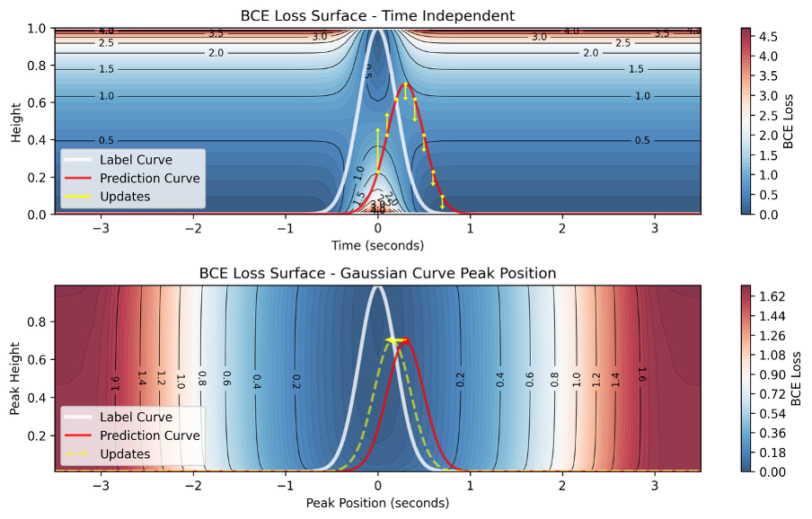

# Loss Landscape Analysis

This folder contains two diagnostic test scripts for analyzing and validating the geometric mechanisms underlying the amplitude suppression phenomenon.

## Scripts Overview

### 1. `loss_landscape_analysis.py`

**Purpose:** Visualize the theoretical loss landscape of point-wise BCE loss

This script generates 2D loss surface visualizations showing BCE loss values across different heights (amplitude) and temporal positions. The visualization clearly reveals:
- Point-wise BCE loss forms a low-loss region at the label peak, but this is not a global minimum
- Additional low-loss regions exist on both sides when amplitude approaches zero
- Point-wise loss only provides vertical gradients (amplitude direction), lacking lateral guidance (temporal direction) to resolve temporal misalignment

This geometric trap explains why models become trapped in amplitude suppression.

The script also demonstrates the loss landscape when constraining model outputs to perfect Gaussian templates:
- The two-sided low-loss regions vanish
- A single global minimum emerges
- Strong lateral guidance is provided

**For detailed theory and results, see paper Fig. 3 (loss landscape) and related discussion.**

---

### 2. `no_model_bce_test.py`

**Purpose:** Numerical simulation experiment deconstructing the core mechanisms of the dynamic optimization trap

This script implements a critical experiment: **removing the entire neural network**, allowing the optimizer to directly perform gradient descent on trainable prediction values. This stripped-down setup isolates and reveals the trap's core mechanisms, independent of neural network complexities.

The experiment systematically varies two key factors:
- **Temporal uncertainty**: Adjusting target distribution width (σ = 0.1, 0.2, 0.3, 0.5)
- **Systematic bias**: Adjusting distribution skewness (skewness = 0, -10)

The script compares two optimizers:
1. **Standard point-wise optimizer**: Directly optimizes individual point values
2. **Gaussian-constrained optimizer**: Constrains output to perfect Gaussian shape

**Key findings:**
- High temporal uncertainty alone induces amplitude suppression
- Systematic bias causes significant temporal offset only when combined with high temporal uncertainty
- The Gaussian-constrained optimizer remains stably anchored at the distribution's true center under all conditions, maintaining at least 0.5 amplitude
- The point-wise optimizer under the most severe conditions (bottom-right) produces features highly similar to observed suppression

This simulation deconstructs the two symptoms of suppression:
- **Amplitude suppression** primarily attributed to temporal uncertainty
- **Temporal offset** attributed to the combination of uncertainty and bias

**For detailed experimental design, parameters, and results, see paper Fig. 4 (simulation) and Methods section.**

---

## Reference

For detailed theoretical analysis, experimental design, and result interpretation, please refer to:
- Paper Section: "Geometric Diagnosis of the Optimization Trap"
- Figure 3: Loss landscape visualization
- Figure 4: Numerical simulation results
- Methods: Detailed experimental setup

